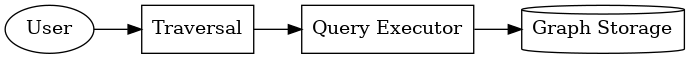
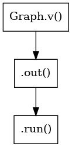
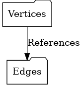
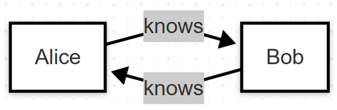

# Dagoba: Простая графовая база данных в оперативной памяти

## Исследование предметной области

### Что такое графовая база данных?
Графовые базы данных — это структуры, в которых данные представлены в виде узлов (вершин) и связей (рёбер). Они идеально подходят для представления социальных сетей, связей, маршрутов, онтологий.

### Особенности:
- Узлы содержат сущности (например, человек, статья).
- Рёбра описывают связи (например, "знает", "связан с").
- Поддерживается быстрое выполнение запросов по связанным объектам.

### Изученные источники:
- [Dagoba на AOSA](https://aosabook.org/en/500L/dagoba-an-in-memory-graph-database.html)
- [build-your-own-x](https://github.com/codecrafters-io/build-your-own-x)
- Официальная документация по Graph DB (Neo4j, ArangoDB)

---

## Шаги по созданию своей графовой базы

### Этап 1. Проектирование архитектуры

Dagoba состоит из 4 основных компонентов:
- Хранилище вершин
- Хранилище рёбер
- Механизм запросов (транслятор)
- Исполнитель запросов



---

### Этап 2. Реализация классов

#### 1. Вершины (Vertex)

```python
class Vertex:
    def __init__(self, id, data=None):
        self.id = id
        self.data = data or {}
```

#### 2. Рёбра (Edge)

```python
class Edge:
    def __init__(self, from_vertex, to_vertex, label=None):
        self.from_vertex = from_vertex
        self.to_vertex = to_vertex
        self.label = label
```

#### 3. Граф (Graph)

```python
class Graph:
    def __init__(self):
        self.vertices = {}
        self.edges = []
```

### Этап 3. Добавление элементов

```python
g = Graph()
g.add_vertex('Alice', {'type': 'person', 'name': 'Alice'})
g.add_vertex('Bob', {'type': 'person', 'name': 'Bob'})
g.add_edge('Alice', 'Bob', 'knows')
```

---

### Этап 4. Выполнение запросов

```python
g.v('Alice').out('knows').run()
```

Запрос проходит следующие этапы:



---

### Этап 5. Организация хранения

Данные хранятся в словарях и списках:



```python
self.vertices = {'Alice': Vertex(...)}
self.edges = [Edge('Alice', 'Bob', 'knows')]
```

---

## Пошаговая инструкция для начинающих

1. Создайте файл `dagoba.py` и вставьте реализацию классов.
2. Создайте файл `test_dagoba.py`:
```python
from dagoba import Graph

g = Graph()
g.add_vertex('Alice', {'type': 'person', 'name': 'Alice'})
g.add_vertex('Bob', {'type': 'person', 'name': 'Bob'})
g.add_edge('Alice', 'Bob', 'knows')
print(g.v('Alice').out('knows').run())
```
3. Запустите:
```bash
python test_dagoba.py
```

---

### Модификация

В рамках выполнения проектной практики была добавлена следующая модификация для Dagoba: поддержка двунаправленных связей
Теперь метод add_edge имеет параметр reverse. Если он установлен в True, то автоматически создаётся обратное ребро — это делает связь двунаправленной.



## Заключение

Вы построили собственную графовую БД с нуля:
- Добавление сущностей
- Установка связей
- Запросы к графу

---

## Список иллюстраций
1. Архитектура Dagoba — `architecture.png`
2. Выполнение запроса — `query_execution.png`
3. Хранение графа — `graph_storage.png`
